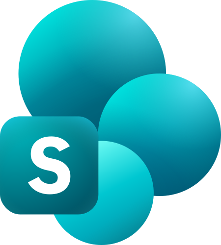

{/* AUTO-GENERATED CONTENT START */}

  
  <h1 style={{ margin: 0 }}>SharePoint Online</h1>

This connector syncs data from SharePoint Online via the Microsoft Graph API with **full access control (ACL) support**. It extracts permissions from drive items and expands Entra ID group memberships so that Airweave can enforce per-user search filtering.

## How It Works

The connector syncs the following entity hierarchy:

- **Sites** — SharePoint sites discovered via search or explicit URL
- **Drives** — Document libraries within each site
- **Files** — Documents in drives (with content download and ACL extraction)
- **Pages** — SharePoint site pages (optional)

### Access Control Pipeline

For each file, the connector extracts Graph API permissions and maps them to canonical principals:

| Principal Type | Format | Example |
|---|---|---|
| User | `user:{email}` | `user:alice@contoso.com` |
| Entra ID group | `group:entra:{group_id}` | `group:entra:abc-123-def` |
| SP site group | `group:sp:{group_name}` | `group:sp:site_members` |

Entra ID groups are recursively expanded via `/groups/{id}/members` to resolve all transitive memberships (users and nested groups).

### Incremental Sync

The connector uses [Microsoft Graph delta queries](https://learn.microsoft.com/en-us/graph/delta-query-overview) to track changes per-drive. Delta tokens are stored in the cursor and used on subsequent syncs to fetch only changed items.

{/* AUTO-GENERATED CONTENT END */}

## Authentication

This connector uses **OAuth 2.0** with Microsoft identity platform (Entra ID).

### Required Scopes

| Scope | Purpose |
|---|---|
| `offline_access` | Refresh tokens |
| `User.Read.All` | Read user profiles for principal resolution |
| `Group.Read.All` | Read groups and basic membership |
| `GroupMember.Read.All` | Transitive membership reads for deep group nesting |
| `Directory.Read.All` | Tenant-wide group/user visibility for complete ACL resolution |
| `Sites.Read.All` | Read sites, lists, pages |
| `Files.Read.All` | Read drive items, delta queries, item permissions |

<Callout intent="info">
**Admin consent required.** The `Directory.Read.All` and `GroupMember.Read.All` scopes require tenant admin consent. Without these, group membership expansion may be incomplete.
</Callout>

### Azure App Registration Setup

<Steps>
<Step title="Create App Registration">
In the [Azure Portal](https://portal.azure.com), go to **Entra ID** → **App registrations** → **New registration**.

- Name: `Airweave SharePoint Integration`
- Supported account types: **Accounts in this organizational directory only**
- Redirect URI: `http://localhost:8080/auth/callback` (or your Airweave instance URL)
</Step>

<Step title="Configure API Permissions">
Under **API permissions** → **Add a permission** → **Microsoft Graph** → **Delegated permissions**, add:

- `offline_access`
- `User.Read.All`
- `Group.Read.All`
- `GroupMember.Read.All`
- `Directory.Read.All`
- `Sites.Read.All`
- `Files.Read.All`

Click **Grant admin consent** for your tenant.
</Step>

<Step title="Create Client Secret">
Under **Certificates & secrets** → **New client secret**, create a secret and note the value.
</Step>

<Step title="Configure in Airweave">
Add the `client_id`, `client_secret`, and tenant information to your Airweave integration configuration.
</Step>
</Steps>

## Configuration Options

| Field | Required | Description |
|---|---|---|
| `site_url` | No | URL of a specific SharePoint site to sync. Leave empty to sync all accessible sites. |
| `include_personal_sites` | No | Whether to include OneDrive personal sites. Default: `false`. |
| `include_pages` | No | Whether to sync SharePoint site pages. Default: `true`. |

## ACL Testing

This connector has a dedicated ACL test suite in the [`acl-connector-testing`](https://github.com/airweave-ai/acl-connector-testing) repository.

The test suite uses a **separate Azure app registration** with additional write scopes for test data population:

| Additional Scope (test only) | Purpose |
|---|---|
| `User.ReadWrite.All` | Create/manage test users |
| `GroupMember.ReadWrite.All` | Manage test group memberships |
| `Sites.ReadWrite.All` | Create test sites and content |
| `Files.ReadWrite.All` | Create/delete test files |

See the [ACL Connector Testing README](https://github.com/airweave-ai/acl-connector-testing) for setup instructions.

## Data Models

<Accordion title="SharePointOnlineSiteEntity">

Represents a SharePoint Online site.

| Field | Type | Description |
|---|---|---|
| `site_id` | `string` | Graph site ID |
| `display_name` | `string` | Site display name |
| `web_url` | `string` | Site web URL |
| `description` | `string` | Site description |
| `is_personal_site` | `boolean` | Whether this is a OneDrive personal site |
| `created_at` | `datetime` | Creation time |
| `last_modified_at` | `datetime` | Last modified time |

</Accordion>

<Accordion title="SharePointOnlineDriveEntity">

Represents a document library (drive) within a site.

| Field | Type | Description |
|---|---|---|
| `drive_id` | `string` | Graph drive ID |
| `name` | `string` | Drive name |
| `drive_type` | `string` | Drive type (e.g., `documentLibrary`) |
| `web_url` | `string` | Drive web URL |
| `site_id` | `string` | Parent site ID |
| `quota_total` | `integer` | Total quota in bytes |
| `quota_used` | `integer` | Used quota in bytes |

</Accordion>

<Accordion title="SharePointOnlineFileEntity">

Represents a file in a document library. Extends `FileEntity` with ACL support.

| Field | Type | Description |
|---|---|---|
| `spo_entity_id` | `string` | Composite ID: `spo:file:{drive_id}:{item_id}` |
| `item_id` | `string` | Graph drive item ID |
| `drive_id` | `string` | Parent drive ID |
| `file_name` | `string` | File name with extension |
| `web_url` | `string` | File web URL |
| `parent_path` | `string` | Parent folder path |
| `created_by` | `string` | Created by user |
| `last_modified_by` | `string` | Last modified by user |
| `access` | `AccessControl` | ACL viewers list |

</Accordion>

<Accordion title="SharePointOnlineItemEntity">

Represents a list item (non-file).

| Field | Type | Description |
|---|---|---|
| `spo_entity_id` | `string` | Composite ID: `spo:item:{site_id}:{list_id}:{item_id}` |
| `item_id` | `string` | Graph item ID |
| `list_id` | `string` | Parent list ID |
| `title` | `string` | Item title |
| `content_type` | `string` | Content type name |
| `fields` | `object` | List item field values |

</Accordion>

<Accordion title="SharePointOnlinePageEntity">

Represents a SharePoint site page.

| Field | Type | Description |
|---|---|---|
| `page_id` | `string` | Graph page ID |
| `title` | `string` | Page title |
| `web_url` | `string` | Page web URL |
| `description` | `string` | Page description |
| `page_content` | `string` | Page HTML content |

</Accordion>

## Differences from SharePoint (Legacy)

| Feature | SharePoint (legacy) | SharePoint Online (this connector) |
|---|---|---|
| Access control | No | Yes — full ACL pipeline |
| Incremental sync | No | Yes — Graph delta queries |
| Group expansion | No | Yes — Entra ID transitive members |
| Entity permissions | Not extracted | Extracted per drive item |
| Cursor | None | Per-drive delta tokens |
